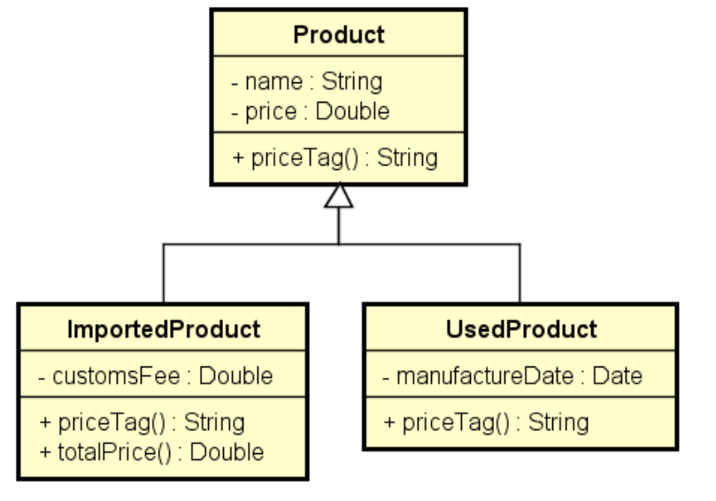

<h1 align="center"> Polimorfismo e Herança </h1>

<p align="center">
Exercício em Java sobre polimorfismo e herança  <br/>

</p>

<p align="center">
  <a href="#rocket-tecnologia">Tecnologias</a>&nbsp;&nbsp;&nbsp;|&nbsp;&nbsp;&nbsp;
  <a href="#computer-projeto">Projeto</a>&nbsp;&nbsp;&nbsp;|&nbsp;&nbsp;&nbsp;
</p>

<p align="center">
  
</p>

<br>

## :rocket: Tecnologia

Esse projeto foi desenvolvido com a seguinte tecnologia:

- Java

## :computer: Projeto

Esse projeto tem por conceito aplicar os conhecimentos estudados pela plataforma de ensino Udemy Academy.

### Enunciado do exercício

Fazer um programa para ler os dados de N
produtos (N fornecido pelo usuário). Ao final,
mostrar a etiqueta de preço de cada produto na
mesma ordem em que foram digitados.

Todo produto possui nome e preço. Produtos
importados possuem uma taxa de alfândega, e
produtos usados possuem data de fabricação.
Estes dados específicos devem ser
acrescentados na etiqueta de preço conforme
exemplo. Para produtos
importados, a taxa e alfândega deve ser
acrescentada ao preço final do produto.


#### Exemplo

```
Enter the number of products: 3
Product #1 data:
Common, used or imported (c/u/i)? i
Name: Tablet
Price: 260.00
Customs fee: 20.00
Product #2 data:
Common, used or imported (c/u/i)? c
Name: Notebook
Price: 1100.00
Product #3 data:
Common, used or imported (c/u/i)? u
Name: Iphone
Price: 400.00
Manufacture date (DD/MM/YYYY): 15/03/2017

PRICE TAGS:
Tablet $ 280.00 (Customs fee: $ 20.00)
Notebook $ 1100.00
Iphone (used) $ 400.00 (Manufacture date: 15/03/2017)
```

#### Diagrama UML




